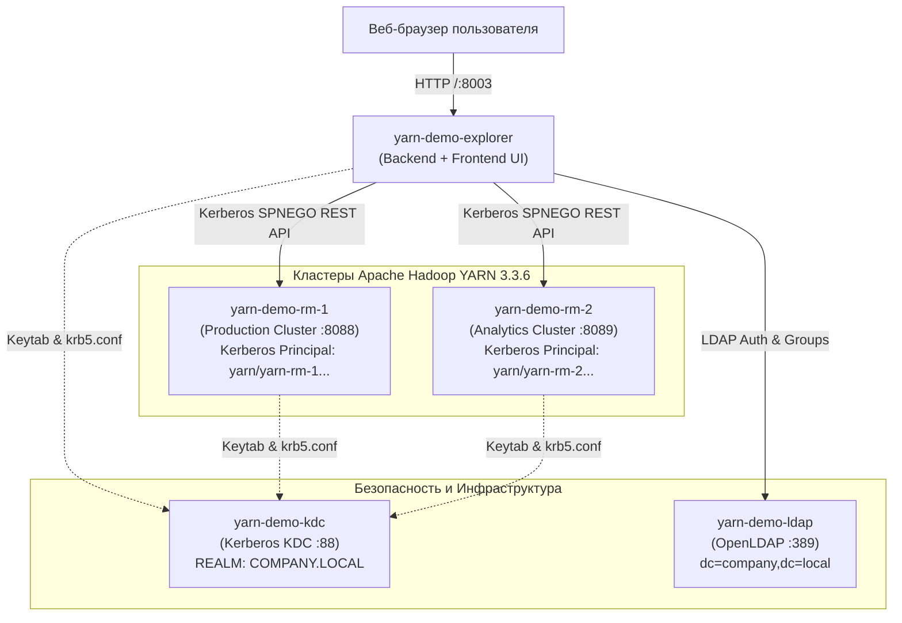

# 🎪 Демонстрационный стенд YARN Queue Explorer

Данный демонстрационный стенд представляет собой полностью автономную, готовую к запуску инфраструктуру в Docker Compose, воспроизводящую реальный корпоративный контур Hadoop с безопасностью на базе **Kerberos (SPNEGO)** и каталогом пользователей **OpenLDAP**.

---

## 🏛 Архитектура стенда



---

## 📦 Сервисы и порты

| Контейнер | Описание | Сетевой адрес / Хост | Порт на хосте |
|---|---|---|---|
| **`yarn-demo-explorer`** | Сервис YARN Queue Explorer (FastAPI + Svelte 5) | `localhost` | **[`http://localhost:8003`](http://localhost:8003)** |
| **`yarn-demo-rm-1`** | Hadoop YARN ResourceManager 1 («Production Hadoop») | `yarn-rm-1.yarn-demo-net` | **[`http://localhost:8088`](http://localhost:8088)** |
| **`yarn-demo-rm-2`** | Hadoop YARN ResourceManager 2 («Analytics & ML») | `yarn-rm-2.yarn-demo-net` | **[`http://localhost:8089`](http://localhost:8089)** |
| **`yarn-demo-ldap`** | Сервер каталогов OpenLDAP с корпоративной структурой | `ldap` | `localhost:389` |
| **`yarn-demo-kdc`** | Kerberos KDC и сервис генерации keytab-файлов | `kdc.yarn-demo-net` | `localhost:88` |

---

## 🔐 Учетные записи пользователей (LDAP)

Стенд преднастроен следующими учетными записями в каталоге `dc=company,dc=local`:

| Логин | Пароль | Роль в системе | LDAP Группа | Разрешенные операции |
|---|---|---|---|---|
| **`admin_user`** | `password123` | **ADMIN** | `hadoop-admins` | Полный доступ: редактирование очередей, балансировка, Queue Mappings, экспорт XML, согласование (Approve/Reject) заявок. |
| **`writer_user`** | `password123` | **WRITER** | `yarn-operators` | Моделирование изменений, редактирование черновиков, отправка заявок на согласование администратору. |
| **`reader_user`** | `password123` | **READER** | `bi-analysts` | Режим только для чтения: мониторинг состояния очередей, утилизации и параметров. |

---

## 🚀 Быстрый запуск

### 1. Требования
- Установленный **Docker** (24.0+) и плагин **Docker Compose** v2.
- Свободные порты: `8003`, `8088`, `8089`, `389`, `88`.

### 2. Запуск стенда
Запуск осуществляется одной командой из корня проекта:
```bash
./demo/start-demo.sh
```
*(Либо из директории `demo/` командами `./start.sh` или `docker compose up -d --build`)*.

При запуске автоматически:
1. Инициализируется Kerberos KDC, создаются принципалы и экспортируются keytab-файлы в общий shared volume.
2. Разворачивается OpenLDAP со структурой подразделений (`ou=users`, `ou=groups`) и тестовыми учетными записями.
3. Запускаются 2 защищенных керберизированных YARN Resource Manager с предустановленными иерархиями очередей.
4. Собирается и запускается контейнер YARN Queue Explorer, ожидающий готовности Kerberos билетов и LDAP.

### 3. Проверка доступности
После запуска откройте в веб-браузере:
👉 **[http://localhost:8003](http://localhost:8003)**

---

## 🛑 Остановка стенда

Для остановки всех контейнеров и полной очистки временных данных и томов (shared keytabs, базы данных):
```bash
./demo/stop-demo.sh
```
*(Либо из директории `demo/` командами `./stop.sh` или `docker compose down -v`)*.

---

## 📋 Пошаговые сценарии для демонстрации

### Сценарий 1: Мультикластерность и мониторинг очередей
1. Откройте интерфейс `http://localhost:8003` и войдите под учетной записью **`admin_user`** / `password123`.
2. В верхнем правом углу переключите активный кластер:
   - **`Production Hadoop Cluster`** (2 ТБ RAM, 1024 vCores, ветки `root.etl`, `root.bi`, `root.ad_hoc`, `root.streaming`).
   - **`Analytics & ML Cluster`** (1 ТБ RAM, 512 vCores, ветки `root.ml_training`, `root.spark_batch`, `root.feature_store`).
3. Обратите внимание на визуализацию ресурсов: шкалы емкости (Capacity), абсолютные значения RAM / vCPU и фактическую утилизацию.

### Сценарий 2: Моделирование распределения и Capacity Balancer
1. Выберите очередь `root.etl.critical` и нажмите иконку редактирования.
2. В появившемся drawer измените **Guaranteed Capacity** с 50% на 60%.
3. Обратите внимание на работу связанного пересчета (Linked Mode) и индикатор баланса ветки:
   - Если сумма дочерних очередей не равна 100%, интерфейс предупреждает о дисбалансе.
   - Воспользуйтесь кнопкой автоматической балансировки (**Auto Balance**), чтобы пропорционально распределить остаток ресурсов между соседями.

### Сценарий 3: Настройка Application Limits и политик планирования
1. Откройте редактирование очереди `root.bi.reporting`.
2. Измените политику планирования (**Ordering Policy**) с `FIFO` на `FAIR`.
3. Установите **User Limit Factor** на `0.5x` (ограничение пользователей половиной емкости очереди).
4. Задайте лимиты приложений:
   - `maximum-applications = 200`
   - `maximum-am-resource-percent = 30%`
   - `max-parallel-apps = 15`
5. Сохраните черновик. В таблице в столбце **Policy** отобразится кликабельный бейдж `FAIR · 0.5x`.

### Сценарий 4: Настройка правил сопоставления очередей (Queue Mappings)
1. В шапке приложения нажмите кнопку **Queue Mappings** (или иконку сопоставления правил).
2. Ознакомьтесь с текущими правилами распределения пользователей и групп (`u:%user:%user`, `g:analytics:root.bi`).
3. Добавьте новое правило: для группы `ml-engineers` назначить очередь `root.etl.sandbox`.
4. Измените порядок приоритетов правил с помощью кнопок Move Up / Down или переключитесь в режим Raw-редактора.
5. Сохраните изменения в драфт.

### Сценарий 5: Согласование изменений (Approval Workflow)
1. Выйдите из профиля администратора и войдите под оператором **`writer_user`** / `password123`.
2. Внесите изменения в любую очередь и откройте панель **Diff Panel**.
3. Обратите внимание: у роли WRITER кнопка применения конфигурации заменена на **Отправить на согласование (Submit Change Request)**.
4. Введите обоснование («*Увеличение квоты для квартального закрытия отчетности*») и отправьте заявку.
5. Войдите обратно под **`admin_user`**:
   - В шапке появится красный индикатор новых входящих заявок.
   - Откройте центр согласования, просмотрите детальный side-by-side diff изменений и нажмите **Approve**.

### Сценарий 6: Экспорт и точечная модификация `capacity-scheduler.xml`
1. Нажмите кнопку **Export XML** в верхнем меню.
2. Проверьте сформированный XML:
   - Все сторонние параметры (ACL, `resource-calculator`, комментарии, специфичные тайм-ауты), полученные из кластера, бережно сохранены.
   - Изменены исключительно те параметры, которые редактировались в интерфейсе.
3. Ознакомьтесь с подсказкой по горячему применению конфигурации через `yarn rmadmin -refreshQueues`.

---

## 🛠 Полезные команды для диагностики

- **Просмотр логов стенда**:
  ```bash
  docker compose -f demo/docker-compose.yml logs -f yarn-demo-explorer
  ```

- **Просмотр состояния Kerberos билетов в приложении**:
  ```bash
  docker exec yarn-demo-explorer klist
  ```

- **Проверка поиска пользователей в LDAP**:
  ```bash
  docker exec yarn-demo-explorer ldapsearch -x -H ldap://ldap:389 -b "dc=company,dc=local" -D "cn=admin,dc=company,dc=local" -w adminpassword "(uid=admin_user)"
  ```

- **Проверка доступности YARN ResourceManager по Kerberos REST API**:
  ```bash
  docker exec yarn-demo-explorer curl -s --negotiate -u : "http://yarn-rm-1.yarn-demo-net:8088/ws/v1/cluster/scheduler"
  ```
