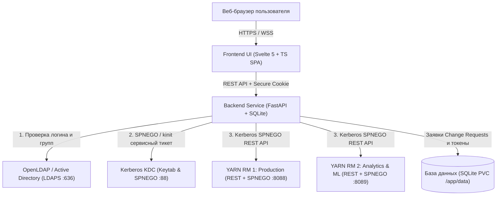

# YARN Queue Explorer

**YARN Queue Explorer** — современный корпоративный веб-интерфейс для интерактивного мониторинга, моделирования, валидации баланса и генерации конфигураций иерархии очередей **Apache Hadoop YARN Capacity Scheduler**. Поддерживает мультикластерность, аутентификацию через **LDAPS** и **Kerberos SPNEGO SSO**, разграничение прав доступа (**ADMIN, WRITER, READER**), безопасную песочницу черновиков (Draft Sandbox & Diff), согласование заявок (Change Requests) и развертывание в **Kubernetes (Helm)**.

---

## 📑 Содержание

- [Специализированная документация](#-специализированная-документация)
- [Ключевые возможности](#-ключевые-возможности)
- [Архитектура решения](#-архитектура-решения)
- [Быстрый старт: Демо-стенд в Docker](#-быстрый-старт-демонстрационный-стенд-в-docker)
- [Тестовые учетные записи (LDAP)](#-тестовые-учетные-записи-ldap)
- [Локальная разработка](#-локальная-разработка)
- [Конфигурация (`config.yaml`)](#️-конфигурация-configyaml)
- [Развертывание в Kubernetes (Helm)](#️-развертывание-в-kubernetes-helm)
- [Тестирование](#-тестирование)
- [Структура проекта](#-структура-проекта)
- [Лицензия](#-лицензия)

---

## 📚 Специализированная документация

| Документ | Содержание |
|---|---|
| 🎪 **[DEMO.md](DEMO.md)** | Подробное руководство по керберизированному демо-стенду (2 кластера YARN RM, OpenLDAP, MIT KDC) и 6 пошаговых сценариев работы |
| ☸️ **[helm/yarn-explorer/README.md](helm/yarn-explorer/README.md)** | Описание параметров `values.yaml`, сетевых политик, Ingress и инструкция по Helm-деплою в Kubernetes |
| ⚙️ **[backend/README.md](backend/README.md)** | Спецификация REST API, архитектура FastAPI, алгоритмы балансировки очередей, хранилище SQLite и запуск тестов |
| 🎨 **[frontend/README.md](frontend/README.md)** | Архитектура интерфейса на Svelte 5 (Runes), компоненты очередей, песочница черновиков и сборка |

---

## 🚀 Ключевые возможности

### 1. Мультикластерность и корпоративная безопасность
- **Единая точка управления**: одновременная работа с множеством независимых кластеров YARN (Production, Analytics, ML) с переключением в реальном времени.
### 2. Корпоративная безопасность и аудит
- **Kerberos SPNEGO SSO**: сквозной беспарольный вход с использованием билета Kerberos из браузера (`Authorization: Negotiate`) с автоматическим обогащением групп из каталога LDAP (`get_user_info`) и пересчетом ролей.
- **LDAPS (Active Directory / OpenLDAP / FreeIPA)**: аутентификация по логину/паролю со строгой проверкой TLS-сертификатов (`verify_cert: true`) и экранированием спецсимволов.
- **Двухуровневый контроль доступа (RBAC & UI ACL)**:
  - **ADMIN** — просмотр, добавление/удаление очередей, редактирование, балансировка, согласование заявок, генерация `capacity-scheduler.xml`.
  - **WRITER** — просмотр, редактирование параметров очередей, моделирование изменений, подача заявок на согласование и просмотр diff.
  - **READER** — безопасный режим только для чтения топологии и метрик утилизации очередей.
  - **Принцип Four-Eyes**: строгий запрет самостоятельного одобрения автором своего Change Request.
- **Эшелонированная защита (OWASP Top 10)**:
  - Сессионные токены передаются исключительно через заголовок `Authorization: Bearer` или защищенные `HttpOnly`, `SameSite=Lax` Cookie (полный отказ от `localStorage` и query-параметров).
  - Строгая защита от CSRF (`verify_csrf`) по точным схемам URL (`urlparse`) с режимом Fail-Closed при отсутствии или несовпадении источников.
  - Скользящий лимитер запросов (Rate Limiting) с защитой от IP Spoofing (доверие `X-Forwarded-For` только от доверенных прокси) и заголовком `Retry-After`.
  - Персистентный отзыв токенов при выходе (Logout Blacklist на PyJWT).
  - Потокобезопасная изоляция сессий `YarnClient` при обращениях к YARN ResourceManager REST API.
  - Строгая изоляция тестовых аккаунтов (`mock_users` активны только при `auth.mode: "mock"`).
  - Автоматические HTTP Security Headers (`Content-Security-Policy`, `X-Content-Type-Options: nosniff`, `X-Frame-Options: DENY`, `Referrer-Policy`).
  - Защита от XML Comment / Configuration Injection при генерации `capacity-scheduler.xml` и защита от BOLA / IDOR в API заявок.
  - Структурированный аудит безопасности (JSON) всех операций входа и изменений очередей для интеграции с SIEM/SOC.
  - Запуск Docker-контейнера от непривилегированного пользователя (`appuser`, UID 10001) и изоляция секретов Helm через Kubernetes `Secret`.

### 2. Управление ресурсами очередей и Node Labels
- **Node Labels и партиционирование кластера**:
  - Назначение очередей на специализированные пулы нод (GPU, SSD, High-Memory, Compute-Only).
  - Индивидуальные квоты `capacity` и `maximum-capacity` в разрезе партиций узлов.
- **Раздельный учет ресурсов RAM и vCPU**:
  - Раздельное или связанное (`RAM = vCPU`) распределение емкости (Capacity) и максимального лимита (Max Capacity / Burst).
  - Двусторонний автопересчет процентов (%) и физических величин (GB / CPU Cores).

### 3. Интерактивное моделирование и валидация
- **Песочница черновиков (Draft Sandbox & Diff)**: безопасное моделирование изменений квот и топологии в изолированном черновике без влияния на боевой кластер.
- **Панель сравнения (Diff Panel)**: визуализация всех изменений перед применением в формате Unified Diff.
- **Автоматический балансировщик (Capacity Balancer)**: контроль инварианта суммы долей дочерних очередей (ровно 100%) с предупреждениями о недораспределении или превышении квот.
- **Точечная генерация XML**: сохранение существующих XML-комментариев и нестандартных свойств при формировании готового `capacity-scheduler.xml`.

---

## 🏗 Архитектура решения



---

## 🐳 Быстрый старт: Демонстрационный стенд в Docker

В репозиторий включен полностью автономный керберизированный демо-стенд, содержащий 2 кластера Hadoop YARN RM (3.4.0), OpenLDAP и MIT Kerberos KDC.

### Состав стенда:
| Контейнер | Назначение | Адрес на хосте |
|---|---|---|
| **`yarn-demo-explorer`** | Портал YARN Queue Explorer (Backend + UI) | **[http://localhost:8003](http://localhost:8003)** |
| **`yarn-demo-rm-1`** | Hadoop YARN RM 1 («Production Hadoop») | [http://localhost:8088](http://localhost:8088) |
| **`yarn-demo-rm-2`** | Hadoop YARN RM 2 («Analytics & ML») | [http://localhost:8089](http://localhost:8089) |
| **`yarn-demo-ldap`** | Сервер каталогов OpenLDAP | `localhost:389` |
| **`yarn-demo-kdc`** | MIT Kerberos KDC (`COMPANY.LOCAL`) | `localhost:88` |

### Запуск одной командой:
```bash
./demo/start-demo.sh
```
*(или `docker compose -f demo/docker-compose.yml up -d --build`)*

После запуска веб-интерфейс доступен по адресу: 👉 **[http://localhost:8003](http://localhost:8003)**.  
Подробное руководство со сценариями тестирования доступно в **[DEMO.md](DEMO.md)**.

### Остановка стенда:
```bash
./demo/stop-demo.sh
```

---

## 🔐 Тестовые учетные записи (LDAP)

| Логин | Пароль | Роль | Группа LDAP | Доступные действия |
|---|---|---|---|---|
| **`admin_user`** | `password123` | **ADMIN** | `hadoop-admins` | Полный доступ: редактирование, добавление, балансировка, генерация XML |
| **`writer_user`** | `password123` | **WRITER** | `yarn-operators` | Просмотр, редактирование параметров, моделирование diff |
| **`reader_user`** | `password123` | **READER** | `bi-analysts` | Только просмотр состояния топологии и метрик очередей |

---

## 💻 Локальная разработка

### Требования:
- Python 3.11+
- Node.js 20+ и npm
- Системные библиотеки Kerberos (`libkrb5-dev` в Debian/Ubuntu или Xcode CLI tools в macOS)

### 1. Запуск Backend:
```bash
cd backend
python3 -m venv .venv
source .venv/bin/activate
pip install -r requirements.txt

# Запуск dev-сервера с автоматической перезагрузкой
export CONFIG_PATH=../config/config.yaml
uvicorn app.main:app --host 0.0.0.0 --port 8000 --reload
```

### 2. Запуск Frontend:
```bash
cd frontend
npm install
npm run dev
```
Фронтенд запустится на `http://localhost:5173` и будет автоматически проксировать `/api` на бэкенд `localhost:8000`.

### 3. Production сборка единого контейнера:
```bash
docker build -t yarn-explorer:latest .
docker run -d -p 8000:8000 -v $(pwd)/config:/app/config yarn-explorer:latest
```

---

## ⚙️ Конфигурация (`config.yaml`)

Конфигурация задается через YAML-файл (путь передается через переменную `CONFIG_PATH`):

```yaml
server:
  host: "0.0.0.0"
  port: 8000
  debug: false
  cors_origins: ["http://localhost:8000", "http://localhost:5173"]

auth:
  mode: "hybrid" # hybrid, ldaps_only, kerberos_only, mock
  jwt:
    secret_key: "CHANGE-ME-IN-PRODUCTION-RANDOM-SECRET"
    algorithm: "HS256"
    expire_minutes: 480
  ldap:
    enabled: true
    server_uri: "ldaps://ad.company.local:636"
    use_ssl: true
    bind_dn: "cn=svc_yarn_explorer,ou=services,dc=company,dc=local"
    bind_password: "ServicePassword"
    user_base_dn: "ou=users,dc=company,dc=local"
    group_base_dn: "ou=groups,dc=company,dc=local"
  kerberos:
    enabled: true
    keytab_path: "/etc/security/keytabs/yarn-explorer.keytab"
    service_principal: "HTTP/yarn-explorer.company.local@COMPANY.LOCAL"

clusters:
  - id: "prod-cluster"
    name: "Production Hadoop YARN"
    resourcemanager_url: "http://yarn-rm-1.company.local:8088"
    auth_type: "kerberos"
    service_principal: "yarn/yarn-rm-1.company.local@COMPANY.LOCAL"
    acl:
      admins: ["hadoop-admins"]
      writers: ["yarn-operators"]
      readers: ["*"]
```

---

## ☸️ Развертывание в Kubernetes (Helm)

В каталог `helm/yarn-explorer` включен готовый Helm-чарт со строгим харденингом безопасности:
- Контейнер от непривилегированного пользователя (`UID 10001`, `readOnlyRootFilesystem`).
- Сетевая изоляция через **NetworkPolicy** (только порты 8000, 53, 88, 636, YARN RMs).
- Автоматическая инициализация Kerberos-билета (`kinit`) через `docker-entrypoint.sh`.
- PersistentVolumeClaim для базы данных заявок Change Requests (`yarn_explorer.db`).

```bash
# Установка чарта
helm upgrade --install yarn-explorer ./helm/yarn-explorer \
  --namespace yarn-system \
  --create-namespace \
  -f custom-values.yaml
```

Подробное руководство по параметрам чарта см. в **[helm/yarn-explorer/README.md](helm/yarn-explorer/README.md)**.

---

## 🧪 Тестирование

Запуск модульных и интеграционных тестов безопасности, балансировщика очередей и API:
```bash
# Запуск через pytest из корня проекта
pytest

# Запуск тестов внутри Docker-контейнера
docker exec yarn-demo-explorer pytest
```

Проверка типов и синтаксиса фронтенда:
```bash
cd frontend
npm run check
```

---

## 📁 Структура проекта

```
yarn-explorer/
├── backend/                     # Бэкенд FastAPI (см. backend/README.md)
│   ├── app/
│   │   ├── api/                 # REST API роутеры (auth, clusters, queues, change_requests)
│   │   ├── core/                # Конфигурация, безопасность, токены, LDAP, Kerberos
│   │   ├── models/              # Pydantic-схемы данных
│   │   └── services/            # Бизнес-логика (YarnClient, CapacityScheduler, Storage, XmlGenerator)
│   ├── tests/                   # Автоматические тесты на pytest
│   ├── docker-entrypoint.sh     # Инициализация Kerberos (kinit) и запуск сервиса
│   ├── requirements.txt         # Зависимости Python
│   └── README.md                # Документация бэкенда и API
├── frontend/                    # Фронтенд Svelte 5 (см. frontend/README.md)
│   ├── src/
│   │   ├── components/          # UI-компоненты (QueueTreeTable, ResourceEditor, DiffPanel, Modals)
│   │   ├── api/                 # Клиентский HTTP сервис
│   │   ├── utils/               # Утилиты форматирования RAM/vCPU
│   │   ├── App.svelte           # Главный компонент интерфейса
│   │   └── types.ts             # TypeScript интерфейсы
│   ├── package.json             # Зависимости и скрипты сборки
│   ├── vite.config.ts           # Конфигурация Vite и dev-прокси
│   └── README.md                # Документация фронтенда
├── demo/                        # Полный демо-стенд (Docker Compose, 2x YARN RM, KDC, LDAP)
│   ├── docker-compose.yml       # Описание сервисов демо-стенда
│   ├── start-demo.sh            # Скрипт быстрого запуска
│   ├── stop-demo.sh             # Скрипт остановки и очистки
│   └── config.yaml              # Конфигурационный файл демо-режима
├── helm/yarn-explorer/          # Production Helm-чарт для развертывания в Kubernetes
│   ├── Chart.yaml               # Описание и метаданные чарта
│   ├── values.yaml              # Параметры по умолчанию
│   ├── templates/               # Манифесты K8s (Deployment, Service, Ingress, PVC, NetworkPolicy)
│   └── README.md                # Документация чарта и параметров values
├── config/                      # Файлы конфигурации приложения (config.yaml)
├── Dockerfile                   # Multi-stage Dockerfile YARN Explorer
├── docker-compose.yml           # Базовый docker-compose сценарий
├── pytest.ini                   # Конфигурация тестов pytest
├── DEMO.md                      # Подробное руководство по демо-стенду и сценариям
└── README.md                    # Главная документация проекта
```

---

## 📄 Лицензия

Распространяется под лицензией Apache License 2.0.
